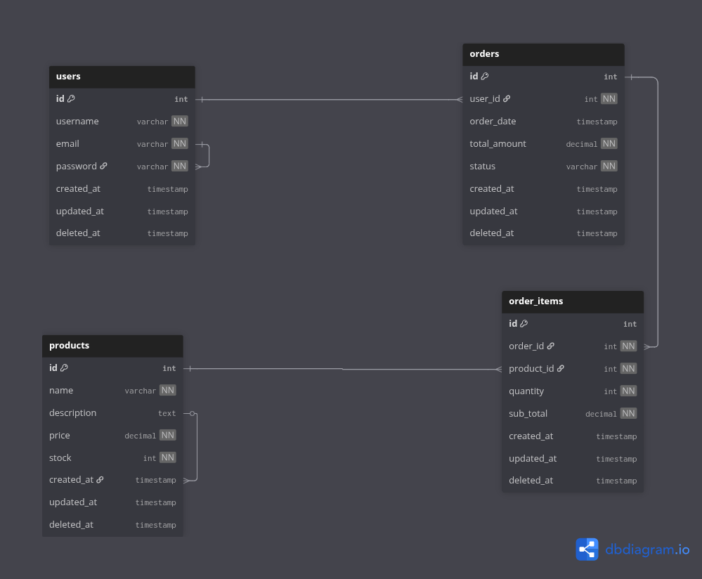
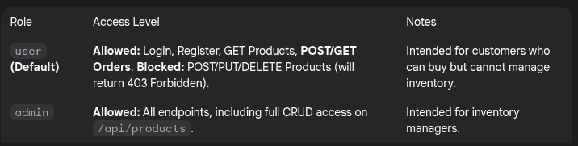

# Mini E-Commerce REST API (Golang Bootcamp Final Project Sanbercode Batch 70) 🛒

# **At this moment, Swagger is not functional, under construction, please consider read this docs for API Docs**

This project implements a simple E-Commerce backend system as a **RESTful API** built using **Go (Golang)**, the **Gin** framework, and **GORM** with a **PostgreSQL** database. This project fulfills all final project requirements, including the implementation of a relational database schema (minimum 4 tables) and **Role-Based Access Control (RBAC)** via JWT.

## Table of Contents

1.  [Project Description](#1-project-description)
2.  [Technology Stack and Dependencies](#2-technology-stack-and-dependencies)
3.  [Database Structure (ERD)](#3-database-structure-erd)
4.  [Setup and Installation](#4-setup-and-installation)
5.  [API Endpoints (Paths)](#5-api-endpoints-paths)
    * [5.1. Authentication (Public)](#51-authentication-public)
    * [5.2. Master Data (Admin Access)](#52-master-data-admin-access)
    * [5.3. Transactions (User Access)](#53-transactions-user-access)
6.  [Project Structure (Routing)](#6-project-structure-routing)
7.  [How to Use & Role Access](#7-how-to-use--role-access)
8.  [How to Use/Test this API](#how-to-use-this-api)

---

## 1. Project Description

This API functions as the backend to manage:
1.  **Users:** User registration and authentication (Login) with JWT and **Role** assignment (`user` or `admin`).
2.  **Products:** Management of product master data (CRUD operations) restricted to **Admin** users.
3.  **Orders:** The core business logic for creating new orders, involving table relations and automatic stock reduction using a **Database Transaction**.

## 2. Technology Stack and Dependencies

* **Programming Language:** Go (Golang)
* **Web Framework:** Gin Gonic
* **Database ORM:** GORM
* **Database:** PostgreSQL (Relational Database)
* **Access Control:** Role-Based Access Control (RBAC) via JWT Claims
* **Security:** `bcrypt` for password hashing
* **Configuration:** `godotenv`

---

## 3. Database Structure (ERD)

The project uses a minimum of 4 interconnected relational tables to demonstrate complex business logic:

| Table | Key Field Added | Description | Key Relationships |
| :--- | :--- | :--- | :--- |
| `Users` | `role` (varchar) | Stores user accounts and roles. | One-to-Many with `Orders` |
| `Products` | - | Product master data. | Many-to-One with `OrderItems` |
| `Orders` | - | Transaction header (links to user and items). | Many-to-One with `Users` |
| `OrderItems` | - | Transaction detail (pivot table linking orders and products). | Many-to-One with `Orders` and `Products` |



---

## 4. Setup and Installation

### 4.1. Prerequisites

* Go **1.21+**
* PostgreSQL running locally or via Docker
* An API testing tool like **Postman** or **Insomnia**.

### 4.2. Setup Steps

1.  **Clone Repository:**
    ```bash
    git clone [https://github.com/ahmadzakirhanif08/sanber_tokoGolang.git](https://github.com/ahmadzakirhanif08/sanber_tokoGolang.git)
    cd sanber_tokoGolang
    ```

2.  **Setup Environment File (`.env`):**
    Create a `.env` file in the project root and fill it with your necessary configurations.

    ```dotenv
    # DATABASE CONFIGURATION
    DB_HOST=localhost
    DB_USER=admoon
    DB_PASSWORD=admoon
    DB_NAME=tokoGolang
    DB_PORT=5432

    # AUTHENTICATION KEYS
    JWT_SECRET=super_secret_jwt_key_panjang # MUST be a long, random string
    ```

3.  **Install Dependencies and Run the Application:**
    ```bash
    go mod download
    go run main.go
    ```
    The application will connect to the database, perform migrations, and start running on `http://localhost:8080`.

---

## 5. API Endpoints (Paths)

All paths are prefixed with `/api`.

### 5.1. Authentication (Public)

| Method | Path | Description | Authorization |
| :--- | :--- | :--- | :--- |
| `POST` | `/api/users/register` | Registers a new user account (default role is `user`). | None |
| `POST` | `/api/users/login` | Logs in and returns the **JWT Token** containing the user's role. | None |

### 5.2. Master Data (Admin Access)

These endpoints require the user to be authenticated via JWT and have the **`role: admin`**.

| Method | Path | Description | Authorization |
| :--- | :--- | :--- | :--- |
| `POST` | `/api/products` | Creates a new product. | **JWT (Admin)** |
| `PUT` | `/api/products/:id` | Updates an existing product's data. | **JWT (Admin)** |
| `DELETE` | `/api/products/:id` | Deletes a product (Soft Delete). | **JWT (Admin)** |
| `GET` | `/api/products` | Retrieves all products. | Public/Guest Access |
| `GET` | `/api/products/:id` | Retrieves a single product by ID. | Public/Guest Access |

### 5.3. Transactions (User Access)

These core transactional endpoints require the user to be authenticated via JWT (any role).

| Method | Path | Description | Authorization |
| :--- | :--- | :--- | :--- |
| `POST` | `/api/orders` | **Creates a new order** (Reduces stock via transaction). | **JWT** |
| `GET` | `/api/orders` | Retrieves all orders belonging only to the authenticated user. | **JWT** |

---

## 6. Project Structure (Routing)

The routing logic is centralized in the `routes` package for clean separation of concerns:

```go
// main.go only handles setup and execution (router := gin.Default(); routes.SetupRouter(router))
// routes/router.go contains:
router.Group("/api").POST("/users/register", ...) // Auth routes
router.Group("/api/products").Use(middlewares.JWTAuthMiddleware(), middlewares.AdminAuthMiddleware()) // Admin protection
router.Group("/api/orders").Use(middlewares.JWTAuthMiddleware()) // Authenticated user protection.

```
## 7. How to use & Role Access
A.  Gain access (JWT)
   1. Perform a `POST /api/users/login` and copy the returned token string.
   2. Include the token in the Authorization Header of every subsequent protected request in the format: Authorization: Bearer <Your JWT Token>

B. Role-base access
  

# How to use this API?

Before start using this Backend, please make sure step below are complete
-   **Run the Server:** Make sure your Golang application is running (`go run main.go`) and listening on `http://localhost:8080`.
    
-   **Define Users:** You need two distinct users in your PostgreSQL database to test RBAC:
    
    -   **User Role:** Register a new user via the API (default role is `user`).
        
    -   **Admin Role:** Register a second user via the API, then manually update their `role` field in the database from `'user'` to `'admin'`.

## Core Authentication and Token Acquisition

| Step | Endpoint | Method | Body/Action | Expected Outcome |
| :--- | :--- | :--- | :--- | :--- |
| Register | `/api/users/register` | `POST` | Create `tester.admin` and `tester.user`. | **201 Created**. |
| Login (Admin) | `/api/users/login` | `POST` | Login with the Admin credentials. | **200 OK**. SAVE ADMIN TOKEN. |
| Login (User) | `/api/users/login` | `POST` | Login with the standard User credentials. | **200 OK**. SAVE USER TOKEN. |

## Testing Role-Based Access Control (RBAC)

This section verifies that your custom `JWTAuthMiddleware` and `AdminAuthMiddleware` are working correctly.
| Scenario | Endpoint | Method | Role Used | Expected Status | Validation Check |
| :--- | :--- | :--- | :--- | :--- | :--- |
| **Admin CRUD Access** | `/api/products` | `POST` | Admin | **201 Created** | Admin successfully creates a product. |
| **User CRUD Block** | `/api/products` | `POST` | User | **403 Forbidden** | Standard user is correctly blocked from inventory management. |
| **Unauthenticated** | `/api/products` | `POST` | None | **401 Unauthorized** | Middleware correctly rejects missing token. |

## Testing Core Business Logic (Orders & Transactions)

This verifies the complexity of your main transactional logic (creating orders, checking stock, and using database transactions).
### A. Create Order (`POST /api/orders`)
| Scenario | Role Used | Input Data | Expected Status | Validation Check |
| :--- | :--- | :--- | :--- | :--- |
| **Success** | User (or Admin) | `{ "items": [ { "product_id": 1, "quantity": 1 } ] }` | **201 Created** | DB Check: Stock for product 1 is reduced by 1. |
| **Insufficient Stock** | User | `{ "items": [ { "product_id": 1, "quantity": 999 } ] }` | **400 Bad Request** | DB Check: Error message is correct ("Insufficient stock"), and NO changes were made to Orders or Products tables (Transaction Rollback success). |

### B. View Orders (`GET /api/orders`)
| Scenario | Role Used | Expected Status | Validation Check |
| :--- | :--- | :--- | :--- |
| **View Own Orders** | User | **200 OK** | Response only lists orders created by this specific user (filtered by user_id). |
| **View Empty Orders** | New User | **200 OK** (or 204 No Content) | Response correctly shows an empty array/list. |

## Testing via Swagger (**UNDER CONSTRUCTION**)

For a final, visual check:

1.  Run `go run main.go`.
    
2.  Open `http://localhost:8080/swagger/index.html`.
    
3.  Click **Authorize**.
    
4.  Enter your **Admin Token** prefixed with `Bearer` (e.g., `Bearer eyJhbGci...`).
    
5.  Test the restricted **POST /api/products** endpoint directly from the Swagger interface.
    

A successful test suite across all these scenarios confirms that your API is robust, secure, and performs its core business logic correctly.


